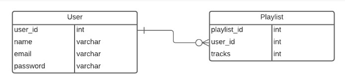

# Design Database With MySQL  

**Menentukan Entity**  
* Berdasarkan requirement yang ada kita bisa mulai untuk mengidentifikasi entity dalam database.  
* Beberapa kandidat yang paling sering menjadi sebuah entity : peoples, things, events, locations  
* Mari kita lihat kembali requirement yang ada, dan kita mulai list entity yang ada.  
* Berikut adalah kandidat yang bisa dijadikan enitity dalam database : user, singer, track, album, playlist  

 

**Menentukan Atribbutes dari Entity**  
* Tahapan ini kita akan menentukan attributes apa saja yang akan datanya kita simpan di dalam sebuah entity.  
* Attributes yang di perlukan didalam entity kemungkinan sudah ada di dalam requirements document, atau mungkin juga diperlukan penafsiran kita sendiri sebagai database developer.  

**User Entity**  

  

**Singer Entity**  

  

**Track Entity**  

 

**Album Entity**

  

**Playlist Entity**

  

 

**Menentukan Relasi Antar Entity**  
* Didalam requrement mungkin sudah dijelaskan relasi dari beberapa entity.  
* Namun terkadang didalam requirement juga tidak dijelaskan mengenai relasi, dan kita sebagai database developer menafsirkan relasi antar entity

**Relasi Entity Singer dan Entity Track**   
*  1 singer punya 1 atau lebih track  
* Relationshipnya adalah one to many

  

**Relasi Entity Album dan Entity Track**  
* 1 Album punya 1 atau lebih track  
* Relationshipnya adalah one to many

  

**Relasi Entity User dan Entity Playlist**  
* 1 User punya 0 atau lebih Playlist  
* Relationshipnya adalah zero or more to many

  

**Relasi Entity Playlist dan Entity Track**  
* 1 Playlist punya 1 atau lebih Track  
* 1 Track bisa ada di banyak playlist  
* Relationshipnya adalah many to many  
* Untuk relasi many to many, kita butuh entity tambahan sebagai penghubung, (conjunction)

**Relasi Entity Playlist dan Entity Track**  
Relasi asli :  

 

Conjusction

  

 

**Relationship Entity Keseluruhan**  

    

 

**Membuat SQL Table dari Entity**  
* Setelah kita punya ERD, maka kita akan lanjut dengan create table berdasarkan dengan data yang kita punya.  
* Pada kali ini kita akan menggunakan terminal untuk menjalankan query SQL  

**Membuat Table User**  

  

  

**Membuat Table Singer**  

  

  

**Membuat Table Album**

  

 

**Membuat Table Track**

  

  

  

**Membuat Table Playlist**

  

  

**Membuat Table Playlist_Track**

  

  