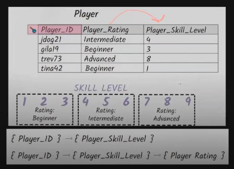

# Design Database With MySQL  
**Normalisasi**  
Teknik yang mengorganisir data le dalam bentuk table supaya :  
* data tidak redunat  
* mudah dicari  
* tidak terjadi anomali  

Biasa digunakan untuk :  
* mendesign database yang dibentuk dari kumpulan data  
* design database kurang bagus, masih terjadi anomali 

 

**INF**  
* tidak ada urutan dalam penyimpanan data  
* harus menggunakan tipe data yang sama pada 1 kolom  
* harus ada primary key  
* tiap kolom harus berisi nilai tunggal  

 

**2NF**  
* harus ada bentuk 1NF  
* tidak ada partial dependency (atribut yang tidak ada hubungannya dengan primary key akan dipisah)  

 

**3NF**  
* harus dalam bentuk 2NF  
* tidaka ada transitif depedency (setiap atribut harus bergantung pada primary key supaya tidak terjadi transitif depedency)  

