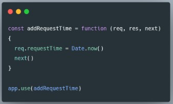
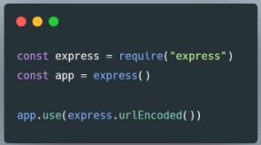

# Express JS  
Express.js, atau hanya Express, adalah kerangka aplikasi web back end untuk Node.js, dirilis sebagai perangkat lunak sumber terbuka dan gratis di bawah Lisensi MIT. Ini dirancang untuk membangun aplikasi web dan API. Ini telah disebut sebagai kerangka kerja server standar de facto untuk Node.js.  

Back end app adalah aplikasi yang berjalan di server-side yang bekerja untuk memberikan informasi berupa data sesuai request dari client / browser / front end app. Umumnya server-side app membuat REST API  

  

Kelebihan dari framework ini terletak pada fitur caching, support dengan Google V8 Engine, JavaScript, serta didukung oleh komunitas dan skalabilitas aplikasi yang baik.  

 

### Rest API  
RESTful API / REST API merupakan penerapan dari API (Application Programming Interface).   
Sedangkan REST (Representional State Transfer) adalah sebuah arsitektur metode komunikasi yang menggunakan protokol HTTP untuk pertukaran data dimana metode ini sering diterapkan dalam pengembangan aplikasi. Dengan tujuannya untuk menjadikan sistem memiliki performa yang baik, cepat dan mudah untuk di kembangkan (scale) terutama dalam pertukaran dan komunikasi data.  

Restful API memiliki 4 komponen penting yaitu :  
* URL Design  
* HTTP Verbs  
* HTTP Response Code  
* Format Response  

  

 

**Basic Syntax expressJS**  

  

 

### Basic Routes  
**Routes**  
Routes adalah sebuah end point yang diapat kita akses menggunakan URL di website. Didalam routes kita perlu menentukan method API, alamat dan response apa saja yang akan dikeluarkan  

  

Kita bisa menjalankan aplikasi sederhana kita dengan cara menggunakan “node”. Dan aplikasi kita akan berjalan di alamat ‘http://localhost:3000’  
Kemudian kita dapat mengaksesnya di website dan menambah route yang akan kita akses yaitu “/”

  

 

**Method**  
Kita dapat menggunakan method yang dalam REST API seperti POST, PUT, PATCH dan DELETE

  

 

**Response**  
Di dalam route kita dapat mengirim response menggunakan parameter dari route express.js yaitu “res.Send()” untuk mengirim plain text ketika kita mengakses route tersebut. Terdapat banyak response yang bisa kita buat selain yang dicontohkan.  
Kita dapat mengirim response berupa output json yang biasa dipakai untuk back end application. Dengan menggunakan output json maka kita dapat mengirim data yang mudah diakses   

  

 

**Status Code**  
Dalam pengaplikasian back end application, kita sangat perlu memberikan status code sebagai informasi apakah route yang kita akses berjalan sebagaimana mestinya dan tidak terjadi error.  

  

 

**Querry**  
Query merupakan parameter yang digunakan untuk membantu menentukan tindakan yang lebih spesifik daripada hanya sekedar router biasa. Biasanya query ditaruh di akhir route dengan memberikan informasi diawali dengan “?” kemudian tedapat key dan data yang dapat ditindak lanjuti. Ex : “?q=hello&age=23”  
Di ExpressJS kita juga dapat membaca query menggunakan req.query, kemudian informasi tersebut dapat kita olah atau kita kembaliakan lagi seperti contoh :  

  

 

**Nested Route**  
Nested route digunakan ketika terdapat banyak route yang memiliki nama yang sama atau ingin membuat route yang lebih mendalam  

  

 

### Express Middleware  
* Middleware function adalah sebuah fungsi yang memiliki akses ke object request (req), object response (res), dan sebuah fungsi next didalam request-response cycle.  
* Fungsi next biasanya di berikan nama variable next.  

  

Hal yang bisa dilakukan Function Middleware  
* Menjalankan kode apapun.  
* Memodifikasi Object Request dan Object Response.  
* Menghentikan request-response cycle.  
* Melanjutkan ke middleware function selanjutnya atau ke handler function dalam suatu request response cycle.  

 

**Kemampuan Fungsi Middleware : Menjalankan Kode Apapun** 
* Sebuah function middleware bisa digunakan untuk mengeksekusi kode apapun untuk suatu tujuan tertentu.  
* Sebagai contoh, kita akan membuat sebuah middleware function yang akan mencetak tulisan “Halo Skilvul, request diterima!” Ketika sebuah HTTP Request masuk kedalam middleware function ini.   
* Middleware Function ini akan diberi nama dengan skilvulLogger.  

  

  

 

**Kemampuan Fungsi Middleware : Memodifikasi Object Request dan Object Response**  
* Sebuah function middleware bisa digunakan untuk memodifikasi Object Request dan Object Response.  
* Sebagai contoh, kita akan membuat sebuah middleware function yang akan menambahkan informasi request time pada object request.
* Middleware Function ini akan diberi nama dengan addRequestTime.  

  

  

 

**Kemampuan Fungsi Middleware : Menghentikan Request-Response Cycle**  
* Sebuah function middleware bisa digunakan untuk menghentikan request-response cycle.  
* Sebagai contoh, kita akan membuat sebuah middleware function yang akan menghentikan request-response cycle.  
* Middleware Function ini akan diberi nama dengan stopHere  
* Request tidak akan pernah sampai ke handler function, karena middleware
telah menghentikan request-response cycle dengan res.send() dan tidak memanggil next()  

  

  

 

**Kemampuan Fungsi Middleware : Melanjutkan Ke Middleware Function Selanjutnya / Ke Handler Function**  
* Sebuah function middleware bisa digunakan untuk melanjutkan ke middleware function selanjutnya / ke handler function.  
* Sebenarnya kita sudah melakukannya pada contoh-contoh sebelumnya, yaitu dengan cara memanggil function next() pada sebuah middleware function.  
* Jika sebuah middleware function tidak mengakhiri request-response cycle, maka middleware tersebut harus memanggil function next() untuk melanjutkan request ke middleware function selanjutnya / ke handler function.  
* Apabila hal tersebut tidak dilakukan (memanggil function next()), maka request akan tetap dalam kondisi menggantung (tidak mengembalikan response) sampai terjadinya error timeout.  

 

**Jenis Express Middleware Berdasarkan Cara Penggunaan**  
Express Middleware dapat dikelompokkan berdasarkan dari dimana middleware function itu digunakan :  
* Application Level Middleware  
* Router Level Middleware  
* Error Handling Middleware  

 

**Jenis Express Middleware Berdasarkan Cara Penggunaan : Application Level Middleware**  
* Application Level Middleware adalah sebuh function middleware yang melekat ke instance object Application Express.  
* Penggunaannya dengan cara memanggil method app.use().  
* Application Level Middleware akan di jalankan setiap kali Express Application menerima sebuah HTTP Request.  

  

 

**Jenis Express Middleware Berdasarkan Cara Penggunaan : Router Level Middleware**  
* Router Level Middleware adalah sebuh function middleware yang cara kerjanya sama persis dengan application level middleware, yang menjadikan perbedaan adalah middleware function ini melekat ke instance object Router Express.  
* Penggunaannya dengan cara memanggil method express.Router().  
* Router Level Middleware hanya akan di jalankan setiap kali sebuah Express Router yang menggunakan middleware ini menerima sebuah HTTP Request, sedangan pada Router yang lain tidak akan dijalankan.  

 

 

**Jenis Express Middleware Berdasarkan Cara Penggunaan : Error Handling Middleware**  
* Error Handling mengacu kepada bagaimana cara sebuah Express Application menangkap dan memproses error yang terjadi, baik itu berupa kesalahan yang synchronous maupun asynchronous.  
* Express Application sudah menyediakan error handle function default, sehingga kita tidak perlu lagi membuat sendiri functionnya.  
* Error handle function default milik Express Application hanyalah kerangka functionnya saja, kita tetap harus menuliskan di dalam function ini bagaimana sebuah error akan di handle.  
* Error Handling Middleware digunakan pada Application Level Middleware  

  

 

**Jenis Express Middleware Berdasarkan Cara Penggunaan : Error Handling Middleware**  
Sebuah error handling middleware function harus memberikan 4 (empat) buah argument (err, req, res, next) agar bisa di deteksi oleh Express Application sebagai error handling middleware, sekalipun kita tidak akan pernah menggunakan function next dalam error handling middleware ini.  
Jika hal ini tidak dilakukan, maka Express Application tidak akan mengenali middleware function ini sebagai error handling middleware, dan akan memperlakukan middleware ini sebagai Application Level Middleware seperti biasa.  

 

**Jenis Express Middleware Berdasarkan Source Middleware Function**  
Express Middleware dapat juga dikelompokkan berdasarkan dari dimana middleware function itu didapatkan :  
* Express Build-in Middleware  
* Third Party (custom) Middleware  

 

**Jenis Express Middleware Berdasarkan Source Middleware Function : Express Build-in Middleware**  
Express JS sudah menyediakan 3 buah build-in middleware function yang bisa digunakan :  
* express.static()  
* express.json()  
* express.urlEncoded()  

 

**Jenis Express Middleware Berdasarkan Source Middleware Function : Express Build-in Middleware**  
express.static()  
* Adalah salah satu build-in middleware function yang disediakan oleh Express JS.  
* Middleware function ini memungkinkan sebuah express application melayani asset statis berupa file, seperti file HTML, gambar, video, dokumen, dan sebagainya.  
* Dokumentasi lengkap   

  

 

**Jenis Express Middleware Berdasarkan Source Middleware Function : Express Build-in Middleware**  
express.json()  
* Adalah salah satu build-in middleware function yang disediakan oleh Express JS.    
* Middleware function ini memungkinkan sebuah express application menerima HTTP Request yang membawa payload (data) dalam format JSON.  
* Middleware function ini tersedia di Express JS versi 4.16.0+ 

 

**Jenis Express Middleware Berdasarkan Source Middleware Function : Express Build-in Middleware**  
express.urlEncoded()  
* Adalah salah satu build-in middleware function yang disediakan oleh Express JS.  
* Middleware function ini memungkinkan sebuah express application menerima
HTTP Request yang membawa payload (data) dalam format urlencoded.  
* Middleware function ini tersedia di Express JS versi 4.16.0+  

  

 

**Jenis Express Middleware Berdasarkan Source Middleware Function : Express Third Party (custom) Middleware**  
Membuat custom middleware function atau menggunakan third party middleware function dapat menambahkan fungsionalitas dari sebuah Express Application.  

  

  

Berikut adalah contoh third party middleware yang dikelola oleh Express JS Team :  
* cors  
* body-parser  
* errorhandler  
* morgan  
* Multer  

Berikut adalah contoh third party middleware yang dikelola oleh community:  
* helmet  
* passport  
* express-validator  
* swager-ui-express