# Intro dan Essential Node JS  
Node.js adalah lingkungan runtime JavaScript open-source, lintas platform, back-end yang berjalan pada mesin V8 dan mengeksekusi kode JavaScript di luar browser web. Node.js memungkinkan pengembang menggunakan JavaScript untuk menulis alat baris perintah dan untuk skrip sisi server—menjalankan skrip sisi server untuk menghasilkan konten halaman web dinamis sebelum halaman dikirim ke browser web pengguna.  

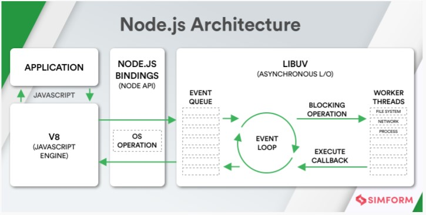 

 

### Node JS Architecture  
**Single Thread**  
Thread dalam ilmu komputer adalah eksekusi menjalankan beberapa tugas atau program secara bersamaan. Setiap unit yang mampu mengeksekusi kode disebut thread.  
Javascript menggunakan konsep single thread, yang berarti hanya memiliki satu tumpukan panggilan yang digunakan untuk menjalankan program.  

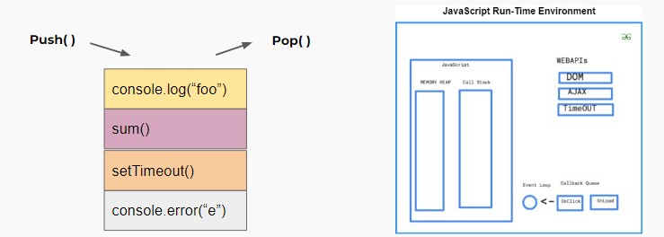  

>Javascript menggunakan call stack untuk melakukan manajemen single thread. Ketika terdapat perintah baru maka akan ditambahkan (push) dan akan di keluarkan ketika perintahnya sudah selasai (pop)  

 

**Even Loop**  
Terdapat event queue yang berguna sebagai penampung ketika terdapat perintah baru yang akan dieksekusi.  
Event loop akan memfasilitasi kondisi ini, event loop akan memeriksa terus menerus, ketika antrian kosong di call stack maka akan menambah antrian baru dari event queue sampai semua perintah selesai di eksekusi.

 

**Server Side Scripting**  
Menggunakan NodeJS kita dapat menjalankan javascript di server side menggunakan terminal command line menggunakan perintah “node”.  

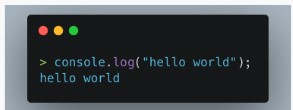  

 

### Javascript Fo Node JS  

**Arrow Expression**  
Arrow expression merupakan fitur terbaru dari javascript, yaitu mempermudah membuat sintaks function menggunakan “=>”  

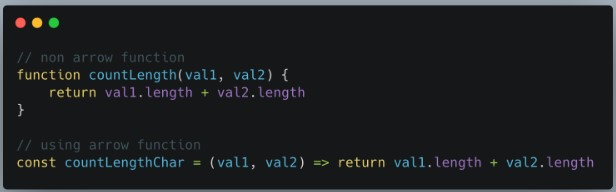  

 

**Asymchronus**  
Javascript mengeksekusi code secara single thread dan berurutan baris per baris yang disebut dengan synchronous. Sedangkan asynchronous memungkinkan mengeksekusi code tanpa berurutan dengan cara “skip” code dan melanjutkan eksekusi code selanjutnya. Konsep ini menungkinkan code kita tidak terjadi blocking dan lebih efisien.

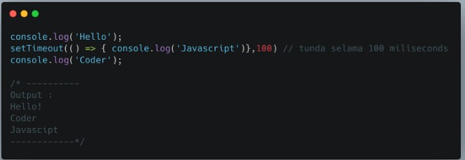  

 

**JSON**  
JSON atau Javascript Object Notation merupakan format yang digunakan untuk menyimpan dan mengirim data menggunakan konsep object di javascript. JSON dapat digunakan di hampir semua bahasa pemrograman sehingga sangat cocok untuk dipelajari.  

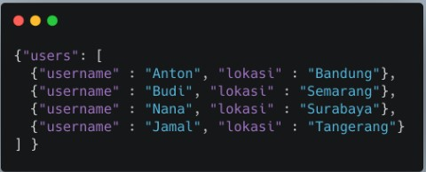  

   

### Build In Module Node JS  

**Console**  
Console merupakan module bawaan dari javascript yang ada di node JS untuk digunakan sebagai debug atau menampilkan code secara interface.  

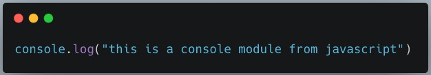  

   

**Process**  
Process adalah modules yang digunakan untuk menampilkan dan mengontrol prosess Node JS yang sedang dijalankan.  

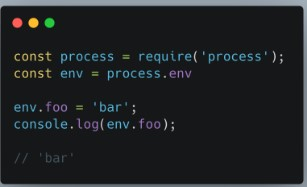  

 

**OS**  
OS module merupakan module yang digunakan untuk menyediakan informasi terkait sistem operasi komputer yang digunakan user.  

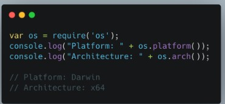  

   

**Util**  
Module Util merupakan alat bantu / utilities untuk mendukung kebutuhan internal API di Node JS  

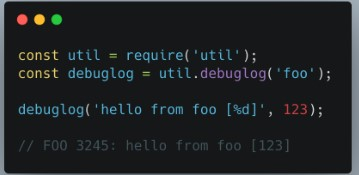  

 

**Events**  

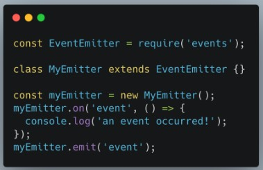  

 

**Errors**  
Errors merupakan modules yang dapat digunakan untuk mendefinisikan error di Node JS sehingga lebih informatif. Kita juga dapat menghandle error menggunakan try catch.  

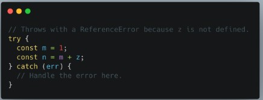  

 

**Buffer**  
Buffer merupakan modules yang digunakan untuk mengakses, mengelola dan mengubah tipe data raw atau tipe data bytes.  

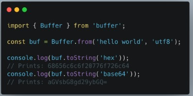  

 

**FS**  
Fs atau “file system” merupakan module yang dapat membantu berinteraksi dengan file yang ada diluar code. FS paling sering digunakan untuk membaca file dengan ekstensi .txt, .csv, dan .json  

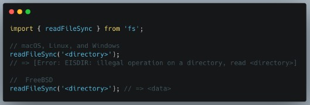  

 

**Timers**  
Timers merupakan modules yang digunakan untuk melakukan scheduling atau mengatur waktu pemanggilan fungsi yang dapat diatur di waktu tertentu  

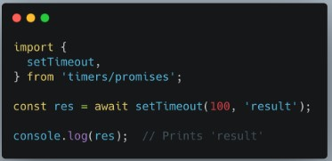  

 

### Membuat Web Server dengan Node JS  
**Node JS Web Server**  
Node.js memiliki built-in modul yang disebut HTTP, built-in modul ini memungkinkan Node JS mentransfer data melalui Hyper Text Transfer Protocol (HTTP).  
Modul HTTP dapat membuat server HTTP yang mendengarkan port server dan memberikan respons kembali ke klien.  

* Untuk menggunakan modul HTTP, gunakan require()  
* Gunakan method createServer() untuk membuat server HTTP  
* Callback function yang digunakan pada method http.createServer(), akan dijalankan ketika seseorang mencoba mengakses komputer pada port 8080.  

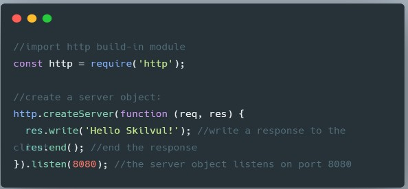  

 

**Menambahkan HTTP Header :**  
* Kita bisa menggunakan method res.writeHead() untuk menambahkan header HTTP.  
* Argumen pertama dari method res.writeHead() adalah status code, 200 berarti semuanya OK  
* Argumen kedua adalah objek yang berisi header respons.  
* Contoh :   
Jika respons dari server HTTP seharusnya ditampilkan sebagai HTML, maka kita harus menambahkan header HTTP dengan tipe konten yang benar

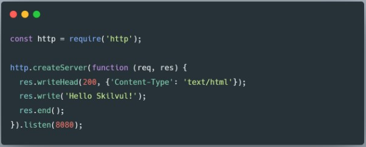  

* Respons yang dikembalikan dari HTTP web server bisa dalam berbagai format.  
* Contohnya, Kita bisa mengembalikan response dalam format JSON dan HTML, namun kita juga dapat mengembalikan format teks lain seperti XML dan CSV.  
* Selain itu web server dapat mengembalikan data non-teks seperti PDF, file zip, audio, dan video  
* Format ini harus ditambahkan kedalam HTTP Header.  

 

**Membaca Querry String**  
* Callback function pada method http.createServer() memiliki argumen req yang mewakili request dari klien, sebagai objek (objek http.IncomingMessage).  
* Objek ini memiliki sebuah properti yang disebut "url" yang menyimpan informasi url yang sedang mengakses.  

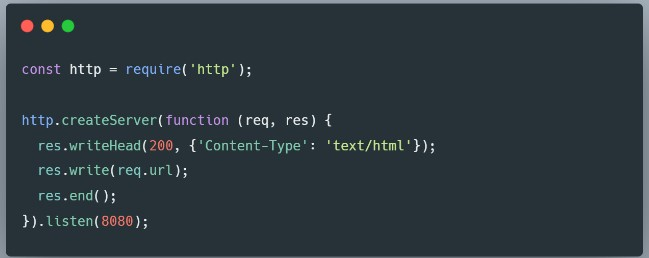  

   

**Split Querry String**  
* Ada build-in module yang bisa kita gunakan untuk split query string menjadi beberapa bagian yang dapat dibaca.  
* Build-in modulenya adalah URL Module.

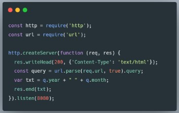