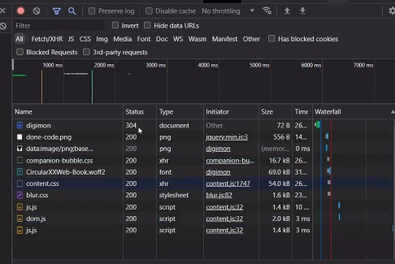

# Web Server dan RESTful API  

Web server terdiri dari 2 komponen penting :  
* Hardware  
* Software  

Web server adalah tempat kita menaruh code back-end maupun front-end.  
Contohnya kayak netlify.  

  
>Ilustrasi  

   

#### Hardware  
Server web adalah komputer yang menyimpan perangkat lunak server web dan file komponen situs web. (misalnya, dokumen HTML, gambar, CSS stylesheet, dan file JavaScript) Server web terhubung ke Internet dan mendukung pertukaran data fisik dengan perangkat lain yang terhubung ke web.  

  

>Ilustrasi hardware  

   

#### Software  
Di sisi perangkat lunak, server web mencakup beberapa bagian yang mengontrol bagaimana pengguna web mengakses file yang dihosting. Minimal, ini adalah server HTTP. Server HTTP adalah perangkat lunak yang memahami URL (alamat web) dan HTTP (protokol yang digunakan browser Anda untuk melihat halaman web). Server HTTP dapat diakses melalui nama domain situs web yang disimpannya, dan mengirimkan konten situs web yang dihosting ini ke perangkat pengguna akhir.  

   

>Software Ilustrasion  

 

Mockapi masuk Back-end. Tetapi mockapi tdk perlu ngoding, trus do consume ke kodingan.  

  

>Tempat kompleks  

Sebelum masuk ke server dan database masuk dlu ke back server yg dimana pengabungana hardware dan software tempat apk berada nantinya, dmana apk itu diakses menggunakan method yg namanya http.  

   

**Metode-Metode Request**  

   

>bentuk tradisional  

emisal ke netlify ada namanya TPA3.movie.app  
dia minta ke server dan dikembalikan ke browser  
setiap user mengclik yang diinginkan maka akan direquest ke server minta halaman htmlnya  
server akan memberi bentuk halaman html ini  

  

>cara ke2  

Dimana ketika buka apk, uniknya minta bentuk json  
json akan diberika ke browser  
apk react akan minta data nay melalui api  
apk react akan minta data nay melalui api  
dibalikin lalu ditampilin  
dia engga meminta halaman/tdk mengganti halaman  

  

>cara ke3  

proses akan dilakukan pada sebagain server  
proses full di bagian server, dia bisa ngasih bagian json dan html  

 

**Motode arsitektur yg dipake**  

  

>Front-end dan Back-end dipisah  

 

**Arsitektur dr web service**  

   

   

   

**Rest**  
Representational State Transfer  
Salah satu arsitektur design untuk membuat web service  

Rules :  
* Uniform interface  
* client-server  
* stateless  
* cacheable  
* Layered system  
* Code on demand (optional)  

Berbasis klien server, klien itu web app. server yang akan dipelajari yg akan membuat API
Arti stateless : tidak bergantung pada data yg dimiliki user, bisa dipasangi sistem casing, dll  
API yang menerapkan rules di atas disebut Restful API  
Rest arsitektur, dia memiliki beberapa rules, kalau API yang menerapkan rules di atas maka akan disebut dengan restfull API  
Hubungan HTTP dan API : HTTP itu protocol komunikasi yg digunakan komunikasi antar website, atau mau akses web, HTTP itu jalur.  
API jalan pada jalur http sehingga bisa sampe ke server, API nanti akan jalan pada jalur HTTP  

**HTTP Method**  
* GET : ngambil data  
* POST : ngirim data baru ke server   
* DELETE : delete data  
* PUT/PATCH : ngeupdate data  
put bisa utk edit sebagain atau keseluruhan  
patch utk update data sebagaian, patch itu gk universal  

 

API bisa dibuat sistem keamanan jdi gk semua bisa mengakses, yg boleh akses cmn admin  

 

**Membuat alamat API yang baik**  
Jikalau ingin buat data user maka buntutnya /users  
alamat bisa digunakan untuk mendapatkan nambahi data baru  
menggunakan kata benda biar lebih mudah  
mengambil 1 data user menggunakan id  

  

>contohnya  

Cara penamaan kalau lebih dari 1 kata menggunakan -,   penamaan hurif kecil semua.

  

 

  

>jenis-jenis pala

Client error : kesalahan pada user  
Server error : kesalahan pada server  

  

>cara melihat status code  

Dalam penamaan Rest API  
* single 
* collection : yg ada s nya, /customers
* document : penulisannya singular jd dibuat id nya
yg singular yg gk make s dan semisal make id  
store make plural juga   
* controller : mengeksekusi sesuatu, dia menggunakan kata kerja